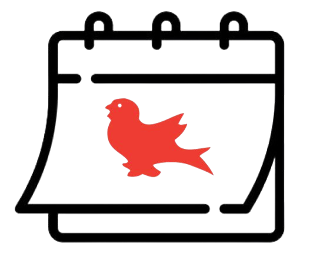

#  Commit2Gather
A booking software that allows McGill University students and teachers alike to better manage their meetings/appointments. Commit2Gather uses a visually intuitive calendar view to keep track of your booking schedule. Users can create or edit their own meetings, and then notify invitees. Don't see a time frame corresponding to your availability? Request an alternate time in a few clicks! 

## Team Knock Your SOCS Off
- Lilan Forsyth
- Lian Lambert
- Vincent St-Pierre

## Tech Stack
- JavaScript
- React
- Node.js
- MongoDB 

## Contributing
Commit messages follow the [conventional commits standard](https://www.conventionalcommits.org/en/v1.0.0/). [Helpful info](https://gist.github.com/qoomon/5dfcdf8eec66a051ecd85625518cfd13).